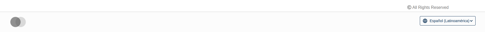
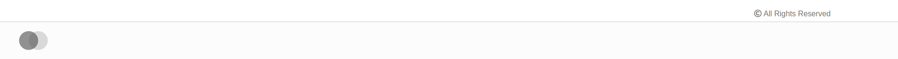

# FooterLanguageSelectorSlot

### Slot ID: `org.openedx.frontend.layout.footer_lang_selector.v1`

### Slot ID Aliases
* `footer_lang_selector`

## Description

This slot is used to repace/modify/hide the language selector in the footer.

## Example



Use the following snipped to hide the selector



```jsx
import { DIRECT_PLUGIN, PLUGIN_OPERATIONS } from '@openedx/frontend-plugin-framework';

const config = {
  pluginSlots: {
    'org.openedx.frontend.layout.footer_lang_selector.v1': {
      plugins: [
        {
          // Hide the default footer
          op: PLUGIN_OPERATIONS.Hide,
          widgetId: 'default_contents',
        },
      ]
    }
  },
}

export default config;
```
