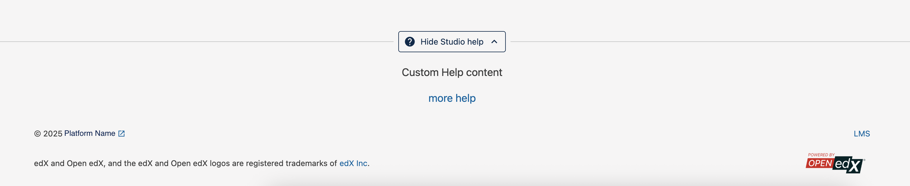

# StudioFooterLogoSlot

### Slot ID: `org.openedx.frontend.layout.studio_footer_help-content.v1`

## Description

This slot is used to repace/modify/hide the help content to the studio footer.

## Examples

### Add a custom help content.

The following `env.config.jsx` will add a custom help content to the studio footer.



```jsx
import { PLUGIN_OPERATIONS, DIRECT_PLUGIN } from '@openedx/frontend-plugin-framework';
import {
  Hyperlink,
} from '@openedx/paragon';

const config = {
  pluginSlots: {
    'org.openedx.frontend.layout.studio_footer_help-content.v1': {
      keepDefault: false,
      plugins: [
        {
          op: PLUGIN_OPERATIONS.Insert,
          widget: {
            id: 'studio_footer_helpcontent_addition',
            type: DIRECT_PLUGIN,
            priority: 40,
            RenderWidget: () => {
              return (
                <div style={{ display: 'flex', flexDirection: 'column', justifyContent: 'center', alignItems: 'center', padding: '20px 5px' }}> 
                  <p>Custom Help content</p>
                  <Hyperlink destination="https://example.com/">more help</Hyperlink>
                </div>
              )
            }
          }
        },
      ],
    }
  },
};

export default config;
```
