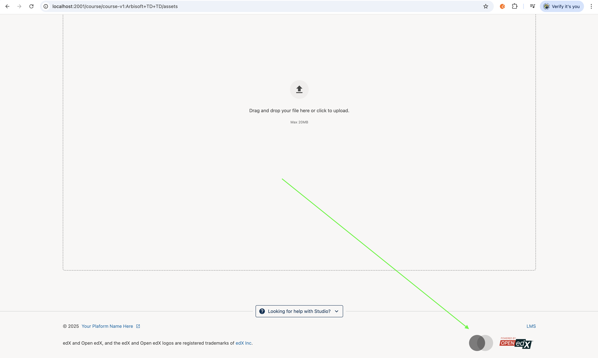

# StudioFooterLogoSlot

### Slot ID: `org.openedx.frontend.layout.studio_footer_logo.v1`

### Slot ID Aliases
* `studio_footer_logo_slot`

## Description

This slot is used to add your site logo to the studio footer.

## Examples

### Add your site logo.

The following `env.config.jsx` will add your site logo to the studio footer.



```jsx
import { PLUGIN_OPERATIONS, DIRECT_PLUGIN } from '@openedx/frontend-plugin-framework';
import {
  Hyperlink,
  Image,
} from '@openedx/paragon';

const config = {
  pluginSlots: {
    'org.openedx.frontend.layout.studio_footer_logo.v1': {
      keepDefault: true,
      plugins: [
        {
          op: PLUGIN_OPERATIONS.Insert,
          widget: {
            id: 'studio_footer_logo_addition',
            type: DIRECT_PLUGIN,
            priority: 40,
            RenderWidget: () => {
              return (
                <Hyperlink destination="https://example.com/" className="float-right">
                  <Image
                    height="48px"
                    alt="Hosted by MySite"
                    src="https://logos.openedx.org/generic-logo.svg"
                  />
                </Hyperlink>
              )
            }
          }
        },
      ],
    }
  },
};

export default config;
```
